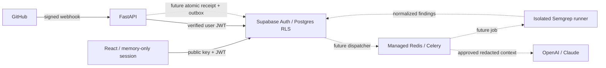

# Architecture and documentation analysis

> This document records the original foundation review. Durable Postgres dispatch,
> installation mappings, deduplication, leases and worker status transitions are now
> implemented; see [current dispatch architecture](scan-dispatch.md). The original
> roadmap table and dotted queue paths below describe the initial scaffold.

The six-page **Technical Documentation.pdf** was reviewed, including its embedded
folder diagrams and Greptile dashboard reference. It specifies hybrid SAST/LLM
review, React, FastAPI, Supabase Auth/Postgres/pgvector, and Celery/Redis. Its future
roadmap is product context, not an instruction to execute code or provision services.

| PDF requirement | Foundation | Remaining integration |
| --- | --- | --- |
| API and validation | FastAPI, Pydantic, explicit CORS, settings | Gateway quotas and observability |
| Supabase and auth | Memory-only sessions, verified tokens, tenant RLS migration | Apply migration and provision cloud membership |
| GitHub webhooks | Raw-body HMAC, body limit, delivery ID validation | Installation ownership, durable outbox/deduplication, fetching diffs, posting reviews |
| Semgrep | Typed, fail-closed scanner stub; separate dependencies | Isolated runner, pinned rules and image |
| OpenAI / Claude | SDK dependencies and typed AI stub | Consent, redaction, provider calls, budgets, model selection |
| Celery / Redis | TLS broker factory, JSON serialization, bounded task settings | Task handlers, retry/dead-letter policy and durable dispatch |
| Dashboard | React/TypeScript, Tailwind v4, Lucide, metrics, searchable table, analytics | GitHub onboarding and Realtime subscriptions |
| pgvector / RAG | Extension enabled | Embedding dimensions, retrieval, tenant isolation and retention |

React with Vite is one of the requested alternatives. Tailwind v4 uses its Vite
plugin and CSS theme instead of the PDF's older JavaScript configuration. Initial
components use Tailwind directly; shadcn can be added when richer primitives are
needed. Runtime execution, multi-agent reviews, third-party context and a CLI remain
roadmap items. Deterministic rule matching does not guarantee 100% security accuracy.

Solid lines are implemented boundaries; dotted workflow connections are planned.
The frontend currently reads Supabase directly. The API exposes authenticated
identity and repository reads for clients that need an API boundary.

## Persistence and authorization

All business persistence belongs in Supabase. There is no SQLite, browser storage,
offline cache or persistent source checkout. SDK sessions live in memory and are
lost on refresh. Build files, virtual environments and tests are development tools,
not application persistence. A future scanner requires disposable scratch, preferably
tmpfs, destroyed at job completion. Redis is queue transport, not the system of record.

The service key bypasses RLS and is reserved for workers and trusted provisioning.
Each API user gets a separate public-key client with their verified bearer token.
Authenticated clients can only SELECT their organizations' data and cannot write
memberships or results. Composite foreign keys prevent cross-tenant parent references.
Provision memberships through a trusted administrator, never browser-provided roles.

## Metric definitions

Total PRs counts all accessible records, including queued and failed reviews.
Active vulnerabilities counts unresolved finding records; workers must resolve or
supersede old findings to avoid duplicate counts across rescans. Security score is
`round(100 × passed / (passed + action_required))`: a review pass rate, not a calibrated
risk score or proof of security. No completed reviews produces an em dash. Analytics
shows the latest 50 PRs. Demo fixtures are labeled and never written to the cloud.

## Production implementation sequence

1. Bind GitHub installation and immutable repository IDs to tenants before fetching.
   Use short-lived installation tokens and validate installation ownership.
2. Atomically write a unique delivery receipt and outbox job in Supabase before 202.
   Add retries, reconciliation, idempotent tasks and dead letters. Delivery ID validation
   alone is not replay protection; actionable PR webhooks currently return 501.
3. Separate acquisition from scanning. Restrict hosts to GitHub APIs, limit downloads
   and archive expansion, reject traversal/symlinks, and fetch immutable commits.
4. Run fixed Semgrep arguments and trusted pinned rules without a shell, repository
   hooks/configs or package installation. Use a non-root sandbox with no network,
   read-only root, bounded tmpfs/CPU/memory/PIDs/time, dropped capabilities and seccomp.
   The API Dockerfile is not a scanner sandbox.
5. Redact secrets before persistence/model egress. Require tenant consent, provider
   retention controls, deadlines and budgets. Treat repository text as untrusted data
   that cannot invoke tools or override instructions. Validate structured AI output;
   require human review and never execute generated patches.
6. Add gateway TLS/HSTS and rate limits, audit events, quotas, rotation, dependency/image
   scanning, backup/restore drills and cross-tenant integration tests before deployment.

## Primary implementation references

- [Supabase token verification](https://supabase.com/docs/reference/python/auth-getuser)
- [Supabase RLS](https://supabase.com/docs/guides/database/postgres/row-level-security)
- [Supabase browser client](https://supabase.com/docs/reference/javascript/initializing)
- [GitHub webhook signatures](https://docs.github.com/en/webhooks/using-webhooks/validating-webhook-deliveries)
- [FastAPI CORS](https://fastapi.tiangolo.com/tutorial/cors/)
- [Tailwind v4 Vite integration](https://tailwindcss.com/docs/installation/using-vite)
